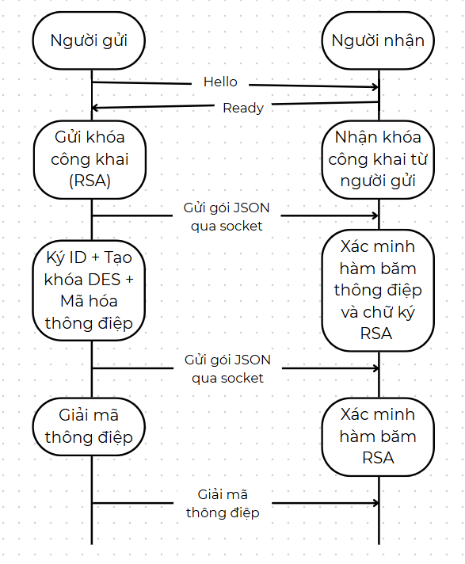
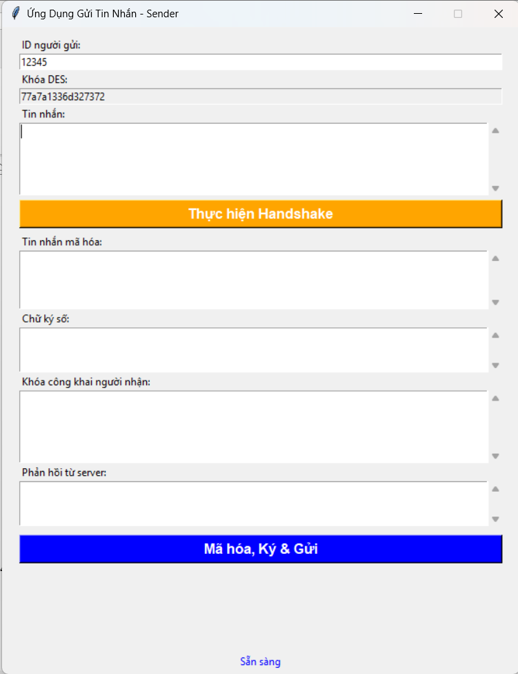
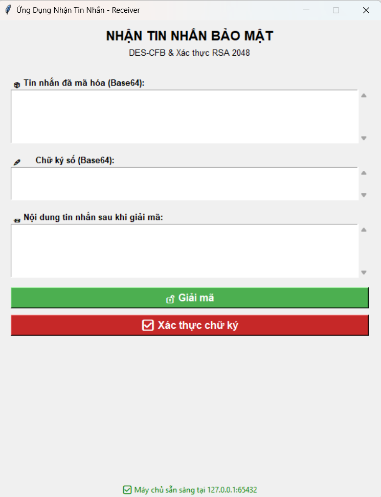

# 📡 Ứng dụng bảo mật tin nhắn văn bản với DES và RSA

## 🚀 Giới thiệu

Đây là **bài tập lớn môn An toàn và Bảo mật thông tin - Đề 18**, xây dựng hệ thống **ứng dụng chat bảo mật tin nhắn văn bản** nhằm đảm bảo:

✅ **Bảo mật nội dung tin nhắn** bằng DES (CFB).  
✅ **Xác thực danh tính** người gửi bằng RSA 2048-bit (OAEP + SHA-256).  
✅ **Đảm bảo toàn vẹn dữ liệu** qua SHA-256.  
✅ Giúp sinh viên hiểu cách ứng dụng mã hóa, chữ ký số, kiểm tra toàn vẹn trong thực tế.

---
## 🛠️ Trình bày kỹ thuật

### 1️⃣ Cấu trúc dự án
Dự án được tổ chức với các thành phần chính sau:
- **`generate_keys_socket.py`**: Tạo cặp khóa RSA 2048-bit cho người gửi và người nhận.
- **`keys.py`**: Tải các khóa RSA từ file PEM để sử dụng trong ứng dụng.
- **`common.py`**: Chứa các hàm mã hóa DES, giải mã, tạo gói tin, và xác thực chữ ký số.
- **`client_socket.py`**: Ứng dụng client với giao diện Tkinter, hỗ trợ nhập tin nhắn, mã hóa, ký số và gửi gói tin.
- **`server_socket.py`**: Ứng dụng server với giao diện Tkinter, nhận gói tin, hiển thị nội dung mã hóa và giải mã.

### 2️⃣ Công nghệ sử dụng

- **Ngôn ngữ:** Python
- **Thư viện:** `socket`, `pycryptodome`, `hashlib`
- **Mô hình:** Client-Server / P2P

### 3️⃣ Các thuật toán triển khai

- **DES (CFB):** Mã hóa/giải mã tin nhắn, tránh bị đọc lén.
- **RSA 2048-bit:** Trao đổi khóa DES, ký số xác thực danh tính người gửi.
- **SHA-256:** Tạo hash kiểm tra tính toàn vẹn tin nhắn.

### 4️⃣ Quy trình hoạt động

1️⃣ **Handshake:** Client gửi "Hello!", server trả lời "Ready!", trao đổi public key RSA.  
2️⃣ **Xác thực & trao khóa:** Client ký ID, mã hóa khóa DES bằng RSA gửi cho server.  
3️⃣ **Mã hóa & gửi:** Client mã hóa tin nhắn bằng DES, tạo hash SHA-256, gửi kèm chữ ký RSA.  
4️⃣ **Nhận & giải mã:** Server kiểm tra hash, xác thực chữ ký, giải mã hiển thị tin nhắn.

---

## 🖥️ Hình ảnh minh họa

### ⚡ Sơ đồ hệ thống



### ⚡ Giao diện Client


*Mô tả*: Giao diện client hiển thị các trường nhập ID, tin nhắn, khóa DES, và các nút để thực hiện handshake, mã hóa và gửi tin nhắn.

### ⚡ Giao diện Server


*Mô tả*: Giao diện server hiển thị tin nhắn mã hóa, chữ ký số, và nội dung đã giải mã sau khi xác thực.

---

## 💻 Hướng dẫn chạy

1️⃣ Cài thư viện:
```bash
pip install pycryptodome
```

2️⃣ Khởi tạo và lấy khóa RSA
```bash
python generate_rsa_keys.py
```
Kết quả sẽ tạo ra 4 file:
   - `sender_private.pem`: Khóa riêng của người gửi.
   - `sender_public.pem`: Khóa công khai của người gửi.
   - `receiver_private.pem`: Khóa riêng của người nhận.
   - `receiver_public.pem`: Khóa công khai của người nhận.

3️⃣ Chạy server:
```bash
python server_socket.py
```

4️⃣ Chạy client:
```bash
python client_socket.py
```

5️⃣ Nhập tin nhắn cần gửi, quan sát kết quả mã hóa, hash, chữ ký và nội dung nhận.

---

## 🌱 Hướng phát triển

✅ Nâng cấp AES thay DES để tăng bảo mật.  
✅ Xây dựng giao diện GUI Tkinter.  
✅ Lưu lịch sử tin nhắn.  
✅ Mở rộng gửi file hoặc voice chat bảo mật.

---

## 🪪 Tác giả

- **Họ tên:** Nguyễn Thị Thùy Linh
- **Lớp:** CNTT16-05
- **Môn:** An toàn và Bảo mật thông tin
- **GVHD:** Trần Đức Thắng

